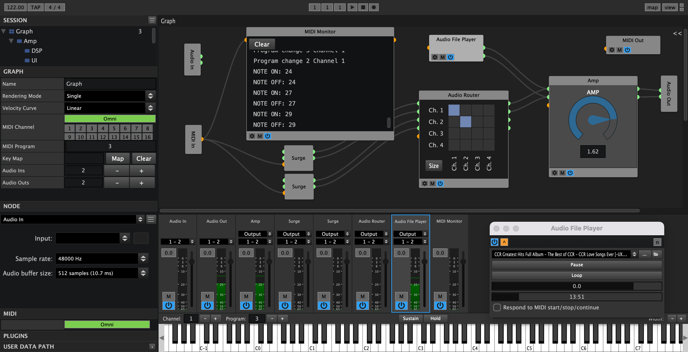

# Element

### ADVANCED AUDIO PLUGIN HOST
This is the community version of Element, a modular AU/LV2/VST/VST3 audio plugin 
host. Create powerful effects, racks and instruments by connecting nodes to one 
another.  Integrates with your existing hardware via standard protocols such as 
MIDI.

### Documentation
See [Element](https://element.readthedocs.io) on Read the Docs.

### Building 
See [kushview.net](https://kushview.net/element/building/) for instructions and dependency information.

### Features
* Runs standalone or as a plugin in your DAW**
* Route Audio and MIDI from anywhere to anywhere
* Play virtual instruments and effects live
* Create re-usable instruments and effect graphs
* External Sync with MIDI Clock
* Sub Graphing – Nest Graphs within each other
* Custom Keyboard Shortcuts
* Placeholder Nodes
* Built In Virtual Keyboard
* Multiple Undo/Redo
* Scripting - Custom DSP and DSP UI's
* Embed plugin UIs directly in Graphs
* And more...

### Compatibility
Element currently loads most major plugin formats.

| OS       | Version       | Formats         |
| -------- |:-------------:| ---------------:|
| Linux*   |       -       | LADSPA/LV2/VST3 |
| Mac OSX  | 10.8 and up   | AU/VST/VST3/LV2 |
| Windows  | XP and up     | VST/VST3/LV2    |

_*Ubuntu is the most tested, but should run on any major distribution_

### Contributing
Want to help widdle down the TODO list? Please review the [code style](https://element.readthedocs.io/en/latest/developers/code-style.html) and [contributor notes](CONTRIBUTING.md) before submitting pull requests.  You may also want to join the [#element](https://discord.gg/fAsQ5fMuHy) channel on the Kushview [Discord](https://discord.gg/fAsQ5fMuHy) server.

### Issue Reporting
Please report bugs and feature requests on Gitlab. [Element issue tracker](https://gitlab.com/kushview/element/-/issues).
