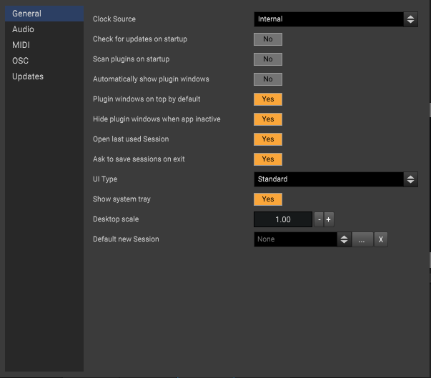
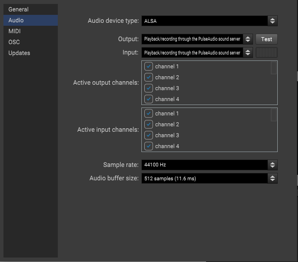
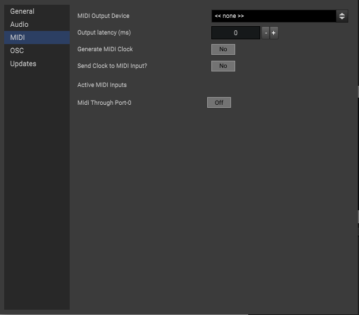
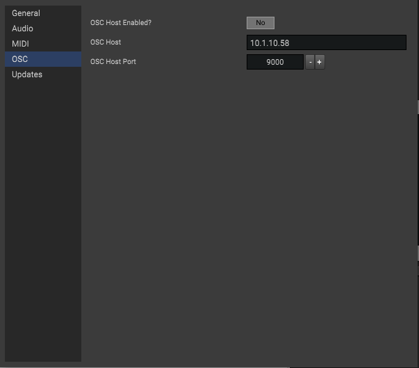
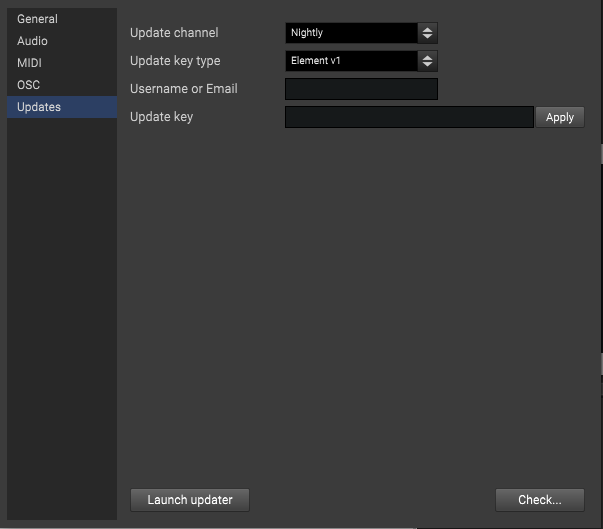

Preferences
===========

Preferences are the main options Element, and can be accessed
through the main menu ``File -> Preferences`` (macOS ``Element -> Preferences``).
Alternatively, some items are available directly in the ``Options`` main menu
as well.

General
-------

=========================================== ==============================================
Option                                      Description
=========================================== ==============================================
**Clock Source**                            Sets the synchronization mode of the audio engine.

                                            - *Internal*: Use the system time base
                                            - *MIDI Clock*: Sync Tempo with incoming from MIDI input.
**Check for updates on startup**            Runs an update check when Element is launched.
**Scan plugins at startup**                 Runs a plugin scan when Element is launched in the background.
**Automatically show plugin windows**       If enabled, will cause plugin windows to show immediately 
                                            after a plugin is added to a graph.
**Plugin windows on top by default**        If enabled, keeps plugin windows on top of others
                                            by default when first shown.
**Hide plugin windows when app inactive**   Hides plugin windows when application focus is lost.
**Open last used Session**                  Setting this to yes causes Element to open the 
                                            last opened Session from disk. Disabling it causes 
                                            a new session to be created on start up.
**Ask to save sessions on exit**            If enabled, ask to save modified sessions. When
                                            disabled, the current session will automatically save.
**Show system tray**                        If enabled, show the application system tray icon.
**Desktop scale**                           Increase or decrease to change the overall 'zoom' of
                                            the application. 1.0 equates to no scaling.
**Default new Session**                     If set, use this session as a template when creating
                                            new sessions.
=========================================== ==============================================    

Audio
-------

=========================================== ==============================================
Option                                      Description
=========================================== ==============================================
**Audio device type**                       The type of device or driver. e.g. JACK, ASIO 
                                            or CoreAudio
**Output**                                  Device to use for audio output.
**Input**                                   Device to use for audio input.
**Active output channels**                  Enable/disable specific device channels
**Active input channels**                   Enable/disable specific device channels
**Sample rate**                             The audio sampling rate to use in the engine.
**Audio buffer size**                       Number of samples to use per processing cycle
**Control Panel**                           If using ASIO, this button will open the 
                                            driver's control panel.
=========================================== ==============================================

MIDI
-------

=========================================== ==============================================
Option                                      Description
=========================================== ==============================================
**Midi Output Device**                      The MIDI device to use as global output.
**Output latency**                          Latency adjustment for MIDI output.
**Generate MIDI Clock**                     Enable to generate MIDI clock.
**Send Clock to MIDI Input?**               When enabled, render MIDI clock as input in 
                                            root level graphs.
**Active MIDI Inputs**                      List of MIDI devices used as the global MIDI
                                            sources.
=========================================== ==============================================

OSC
---

=========================================== ==============================================
Option                                      Description
=========================================== ==============================================
**OSC Host enabled**                        If yes, then run an OSC server.
**OSC Host**                                Hostname or IP address clients connect to.
**OSC Port**                                The network port clients connect to.
=========================================== ==============================================

Updates
-------
Updating is similar to installing and is configured inside ``Element -> Preferences -> Updates``

=========================================== ==============================================
Button                                      Description
=========================================== ==============================================
**Launch button**                           Quits Element and launches the update utility.
**Check button**                            Checks for updates now using the selected channel below.
=========================================== ==============================================

Update Channel
**************
Element is distributed on two release channels to users with an update key. The stable 
channel contains the most reliable builds in the `main` branch.  The nightly channel contains 
builds automatically triggered when code changes in the `develop` branch on GitLab.  Usually 
stability in nightly is on par with stable.  There's also the 
`public downloads <https://kushview.net/element/download/>`_
which tap off the stable channel.

* **Stable** - Continous builds. Well tested.
* **Nightly** - Bleeding edge builds. Well tested, but not as much.

_Please note that nightly builds only get triggered when code is pushed.  This might not
be every single day... namely when the lead developer is working out a new big feature._

Update Key Type
***************
An update key is needed to authorize access to the very latest stable version and the Nightly
repository.

* **Element v1** - The standard update key purchased in the web store.
* **Membership** - Update key acquired through member signup in the web store.
* **Patreon** - Authorize with patreon. `Not recommended`

Username or Email
*****************
This is the username or email associated with your key.  It will vary depending
where you acquired updtate access.
