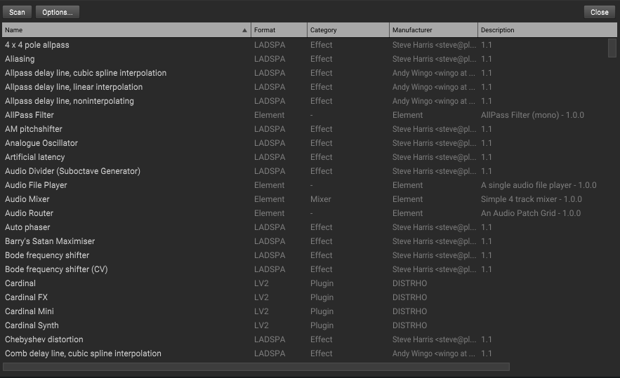

Plugin Manager
==============
The plugin manager is where to scan and manage plugins.  To access it,
go to ``Element -> View -> Plugin Manager``. Click `Scan` to scan all formats.  
Click `Options` to configure formats.

VST Paths
---------
Please follow these steps to change your VST/VST3 plugin folders:

#. Open the Plugin Manager
#. Click Options
#. Choose "Plugin Paths" and select the format to update
#. Add or remove folders
#. Click "Save"
